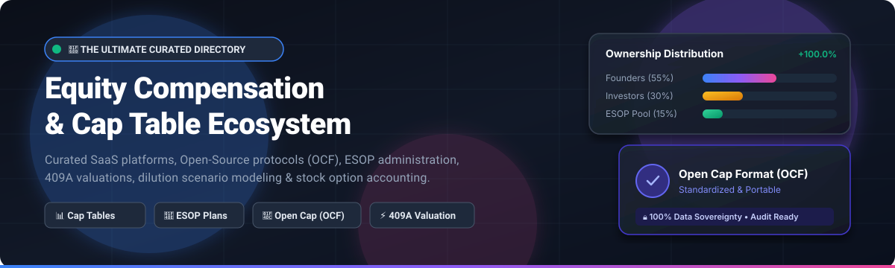

# Awesome Equity Compensation Management & Cap Table Ecosystem 📊

  

  
  
  
  
  
  
  

---

## 🌟 Overview

Welcome to the definitive, SEO-optimized curated directory of **Equity Compensation Management**, **Cap Table Administration**, **ESOP Planning**, **409A Valuations**, and **Open Cap Formats (OCF)**.

Whether you are a startup founder issuing your first SAFEs, an equity administrator handling global stock options and RSUs, or a software engineer integrating standardized cap tables via JSON schemas and smart contracts, this collection catalogs top-tier **SaaS platforms** (ranked by company size and enterprise scale) and **open-source developer tools** (ranked by GitHub stars ⭐).

---

## 📑 Table of Contents
- [🏢 SaaS & Hosted Platforms](#-saashosted-platforms)
- [💻 Open-Source GitHub Projects](#-open-source-github-projects)
- [🛠️ Architecture & System Frameworks](#️-frameworks-for-building-custom-systems)
- [📈 Star History](#-star-history)
- [🤝 How to Contribute](#-how-to-contribute)
- [⚖️ Disclaimer](#️-disclaimer)

---

## 🏢 SaaS/Hosted Platforms

The table below catalogs leading commercial equity compensation and cap table software platforms. The entries are sorted in **descending order of company scale / valuation / revenue**.

| Product | Company Size / Valuation / Revenue | Description | Pricing | Free Tier Limits |
| :--- | :--- | :--- | :--- | :--- |
| **[Morgan Stanley at Work](https://www.morganstanley.com/)** | **~$200B+ Market Cap** (NYSE: MS) / ~$60B+ Rev | Institutional workplace financial suite powering enterprise stock plan administration, global executive services, and wealth management. | Custom institutional enterprise contract based on organization size and service modules | No public free tier or free trial; access provided via employer-sponsored institutional agreement |
| **[Shareworks (Morgan Stanley at Work)](https://www.shareworks.com/)** | **~$200B+ Parent Cap** / Top Enterprise Leader | Institutional-grade equity plan administration platform designed for mature private enterprises, unicorns, and pre-IPO programs. | Annual enterprise contract based on participant count and plan complexity (typically starting $10,000+/year) | No public free tier or free trial; access provided via enterprise sales consultation and live demo |
| **[Global Shares](https://www.globalshares.com/)** | **~$600M+ Acquisition** (J.P. Morgan Workplace) | Premier international equity plan administration platform managing employee share plans across 100+ jurisdictions worldwide. | Annual enterprise license tailored to multi-country compliance and participant volume (typically starting $10,000+/year) | No public free tier or free trial; access provided via enterprise scoping and guided demo |
| **[Carta](https://carta.com/)** | **~$3.5B–$7.4B Valuation** / ~$500M ARR | Category-defining equity management and cap-table platform managing grants, 409A valuations, compliance, and secondary liquidity. | Paid tiers (Build, Grow, Scale) start around $3,000–$8,000/year (Seed) up to $15,000–$25,000+/year depending on stakeholder count | Free forever on **Carta Launch** plan: Up to 25 stakeholders and <$1M total capital raised |
| **[Carta Total Comp](https://carta.com/)** | **~$3.5B–$7.4B Platform** / Add-On Benchmark Leader | Carta’s total compensation intelligence tool combining real-time equity data with global salary and bonus benchmarks. | Add-on module starting around $5,000–$21,000/year depending on company employee count and subscription tier | No free forever plan; access available via scheduled guided product demo/sandbox |
| **[Certent Equity Management](https://www.certent.com/)** | **~$200M+ Acquisition** (insightsoftware) | Enterprise financial reporting and equity plan administration platform specializing in ASC 718, IFRS 2 compliance, and SEC disclosures. | Enterprise annual license tailored to company structure and reporting modules (typically starting $8,000+/year) | No public free tier or free trial; access provided via live product demo and scoping |
| **[Pulley](https://pulley.com/)** | **~$100M+ Est. Valuation** / ~$4M+ ARR (Series B) | Modern, founder-friendly cap table and equity platform offering instant 409A valuations, SAFE round modeling, and onboarding. | Starts at $1,200/year ($100/month billed annually) for Startup plan (up to 25 stakeholders); $3,500/year for Growth plan | 14-day free trial for cap table migration and platform evaluation (no permanent free tier) |
| **[Ledgy](https://www.ledgy.com/)** | **~$80M+ Est. Valuation** / Series B ($30M+ Raised) | European-leading equity management platform built for international compliance, HRIS integrations, and GDPR-native ownership tracking. | Growth plan starts at ~€3 per stakeholder/month (~€36/stakeholder/year); Scale plan starts around €300/month | Free forever on **Launch** plan: Up to 5 equity grants, core cap table, and KPI dashboard; 7-day free trial on paid tiers |
| **[Qapita](https://www.qapita.com/)** | **~$50M+ Est. Valuation** / Series B ($32M+ Raised) | Leading equity and cap table management platform across APAC and emerging markets, offering ESOP management and fund administration. | Starter plan starts at $1,000/year for early-stage teams; Growth & Enterprise scale with custom valuation add-ons | Free forever on **Spark / Basic** plan: Up to 25 stakeholders and basic cap table management |
| **[EquityList](https://equitylist.co/)** | **~$5M Est. Valuation** / ~$1.5M ARR (Seed Stage) | Cap-table and ESOP management platform built for startups and growing enterprises with multi-country stock option schemes. | Paid plans start at $11 per stakeholder/year for standard equity & ESOP administration | Free forever plan: Up to 25 stakeholders and <$1M total funds raised |

---

## 💻 Open-Source GitHub Projects

The table below catalogs active open-source repositories for capitalization tables, open standards, smart vesting contracts, and dilution calculators. The entries are sorted in **descending order of GitHub Star counts (⭐)**.

| Project & Repo Link | Github_Stars | Description | Focus / Tech Stack |
| :--- | :--- | :--- | :--- |
| **[jlevy / og-equity-compensation](https://github.com/jlevy/og-equity-compensation)** |  | The open-source standard guide on equity compensation, stock options (ISOs/NSOs), RSUs, taxes, 83(b) elections, and exit scenarios. | 📚 Comprehensive Guide & Reference |
| **[bradparks / og-equity-compensation](https://github.com/bradparks/og-equity-compensation__or_how_stock_options_work_and_taxes)** |  | Plain-English open reference on how startup stock options work, exercise costs, alternative minimum tax (AMT), and liquidation preferences. | 📖 Equity Guide & Tax Walkthrough |
| **[Open-Cap-Table-Coalition / Open-Cap-Format-OCF](https://github.com/Open-Cap-Table-Coalition/Open-Cap-Format-OCF)** |  | Official JSON schema standard for company capitalization data, enabling interoperable, portable, and machine-readable cap tables. | 📜 Open Data Standard (JSON Schema) |
| **[fairmint / c-org](https://github.com/fairmint/c-org)** |  | Continuous Organization smart contracts enabling decentralized equity, FAIR securities tokenization, and automated bonding curves. | ⛓️ Ethereum / Solidity Smart Contracts |
| **[Open-Cap-Table-Coalition / Open-Cap-eXcel](https://github.com/Open-Cap-Table-Coalition/Open-Cap-eXcel)** |  | Standardized Excel translation tooling and template parsers to convert spreadsheet cap tables into Open Cap Format (OCF) packages. | 📊 Spreadsheet to OCF Translation |
| **[mikemang / cap-table-and-exit-waterfall-tool](https://github.com/mikemang/cap-table-and-exit-waterfall-tool)** |  | Dynamic financial modeling tool for startup cap tables, convertible notes, priced rounds, liquidation preferences, and exit waterfalls. | 📐 Financial Modeling & Waterfall Tool |
| **[1984vc / cap-table](https://github.com/1984vc/cap-table)** |  | Modern TypeScript library to compute cap table ownership, handle SAFE notes conversions, price funding rounds, and model dilution pools. | 💻 TypeScript / NPM Engine |
| **[Open-Cap-Stack / opencap](https://github.com/Open-Cap-Stack/opencap)** |  | Full-featured, self-hosted open-source cap table and equity platform built on OCTA/OCF schemas (open alternative to Carta & Pulley). | 🚀 Full-Stack Web Platform |
| **[andreitoma8 / vesting-contract](https://github.com/andreitoma8/vesting-contract)** |  | Production-ready ERC-20 token vesting smart contracts supporting linear vesting, cliff periods, and multi-beneficiary allocation schedules. | ⛓️ Solidity / Web3 Vesting Engine |
| **[alexfreska / captan](https://github.com/alexfreska/captan)** |  | Developer-centric CLI tool and Git-based plain-text cap table management system with immutable audit trails. | 🛠️ CLI / JSON / Git Audit Tool |
| **[hanzoai / captable](https://github.com/hanzoai/captable)** |  | Open-source equity management suite engineered for modern corporate governance, share registry maintenance, and issuance tracking. | 🌐 Distributed Cap Table Framework |
| **[qbzenker / startupequitycalculator](https://github.com/qbzenker/startupequitycalculator)** |  | Interactive equity and co-founder split calculator for early-stage startup founders evaluating contribution weightings. | 🧮 Equity Calculator & Simulator |

---

## 🛠️ Frameworks for Building Custom Systems

For legaltech and engineering teams building in-house equity management software:

1. **Adopt Open Cap Format (OCF)**: Use OCF as your foundational data model to prevent vendor lock-in and enable seamless exports/imports.
2. **Event Sourcing & Audit Logs**: Treat every grant, exercise, transfer, cancellation, and SAFE note conversion as an immutable event in an audit ledger.
3. **API & HRIS Integrations**: Sync employee status directly with HRIS (Workday, BambooHR, Gusto, Deel, Rippling) to automate vesting cliffs and termination grace periods.
4. **Waterfall & Scenario Engines**: Leverage TypeScript/Python libraries to run instantaneous simulation of post-money SAFEs, unallocated option pool expansions, and exit distribution tiers.

---

## 📈 Star History

---

## 🤝 How to Contribute

Contributions are warmly welcomed! Help keep this directory up-to-date:

1. 🍴 Fork the repository.
2. 📝 Add or update an entry in `README.md` keeping the tables sorted (SaaS by company scale, Open-Source by GitHub stars).
3. 🔗 Ensure all product links, star badges (`style=social&color=white`), and pricing/limit details are accurate.
4. 🚀 Submit a Pull Request with a clear description of changes.

---

## ⚖️ Disclaimer

- This is a **community-curated** educational directory — not an endorsement of specific legal or financial products.
- Equity compensation involves complex corporate law, securities regulations, and tax codes (e.g., IRC 409A, Rule 701, ISO/NSO withholding). Open-source libraries are powerful for modeling, internal analytics, and data portability, but they do not replace certified transfer agents, accredited valuation appraisers, or licensed securities attorneys.
- Always consult qualified legal, accounting, and financial advisors before administering live cap tables or issuing securities.

---

  <b>Built with ❤️ for founders, CFOs, legal teams, and developers striving for transparent and portable equity administration.</b>

